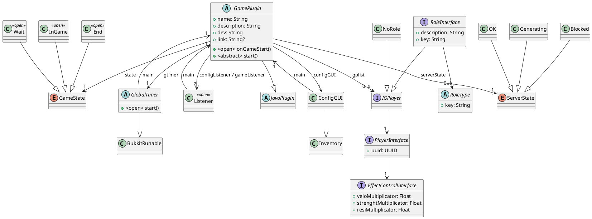

# ReWork UHC API

_This API is subject to conditions of use, please consult the license._

The API linking playable plugins (game, scenarios, terrain generators) and the ReWork UHC Manager.

# General information

- Usage: Minecraft UHC Games

- Server type: Spigot MC

- Preferred version: 1.8.8 Spigot

- Lang: Kotlin (Correto | Temurin dev JVM)

# Version Operation

```
Format: W.X.Y.Z

W = Release Version

X = 1: Alpha | 2: Beta | 3: Stable

Y = Update Version

Z = Patch Version
```
# UML Class Diagram



### Additional information about UML

GamePlugin : onGameStart method is called when the game starts. It follows the following steps:
- Check if ServerState is OK, if not, return.
- Call gtimer.start() to start game timer (on a new thread)
- Call this.start() to start the game.
- Change the game state to InGame

GlobalTimer : start method is called when the game starts. It starts a new timer which is counting each second. Define a GlobalTimer in the API is needed for the Scoreboard Plugin to work properly.